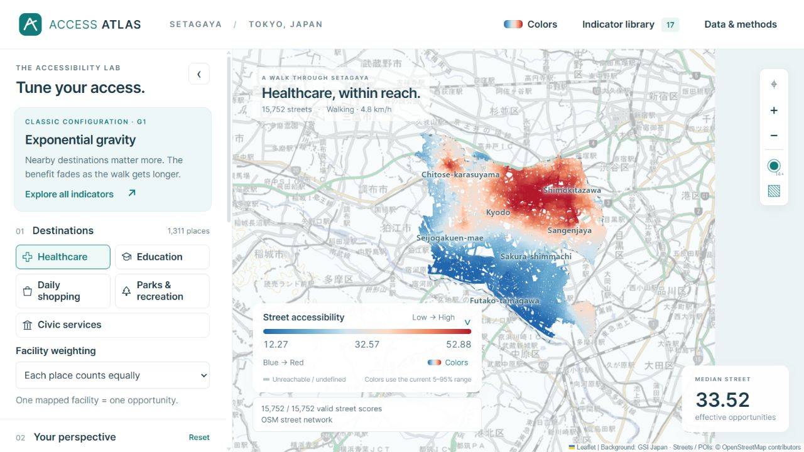

# Setagaya Access Atlas

A portable, browser-based research atlas for exploring parametric street accessibility in Setagaya, Tokyo.

**15,752 street segments · 5 POI categories · 17 classic configurations · real local recalculation**

[中文说明](README.zh-CN.md) · [Parameter guide](dist/guide.html) · [Data and attribution](DATA_SOURCES.md)



## Start locally

1. Download the entire repository with **Code → Download ZIP**, or clone it. Extract the ZIP completely.
2. Install **Python 3.10 or newer** if it is not already available. No pip packages are needed to run the website.
3. Start the app:

| System | Start |
| --- | --- |
| Windows | Double-click **Start Access Atlas.cmd** |
| macOS / Linux | Open a terminal in the extracted folder and run `sh start.sh` |
| Any system | Run `python server.py` (or `python3 server.py`) |

Your browser opens automatically. Keep the terminal window open; press **Ctrl+C** to stop.
The launcher tries port 8765 and automatically selects another free port if it is occupied.
All paths are resolved from the project's own location. Spaces, non-English folder names, renamed folders and a different working directory are supported.

Opening `index.html` as a local file displays startup instructions. The actual map needs HTTP because it uses JavaScript modules, a worker, and local data fetches. There is no build step, login, API key or runtime data download. After installing Python, the complete extracted package works offline; external source links naturally require an internet connection.

Use a current desktop browser that supports module workers, `DecompressionStream`, and Web Crypto. Custom calculations load sizeable route tables into memory; the first calculation in each category can take longer than subsequent adjustments. The largest raw distance table is about 178 MiB, and calculation keeps additional arrays in memory. Desktop use is recommended; low-memory phones can struggle.

## What the atlas shows

- Five destination groups: healthcare, education, daily shopping, parks and recreation, and civic services.
- Adjustable walking radius, distance decay, walking speed, competition, opportunity aggregation and thresholds.
- Classic indicator names when settings match their mathematical configurations; custom accessibility otherwise.
- A zoomable map with bundled background tiles, selectable streets, raw values and median street score.
- Twelve palettes, reverse colors and custom HEX colors. The legend and calculation notes retract together.
- 69 cached result surfaces: 13 POI configurations for each category and 4 network configurations.

The shared mathematical evaluator recovers the listed configurations under their stated assumptions. This is not a claim that every published variant is reproduced. Network centralities are calculated on a junction graph; they are not presented as DepthmapX, NAIN or NACH reproductions. Type-based supply weights and equal-junction demand are scenarios, not observed facility capacity or population.

## Upload to GitHub

Create an empty repository and upload **the contents of this folder as its root**, including `dist/data/routes/`, `raw/`, and the dotfiles. Do not upload the ZIP itself as the source repository. GitHub Desktop or Git is convenient for the complete dataset.

The package is approximately **613 MiB**. Each route chunk is at most **20 MiB**; no Git LFS or separate asset download is required. `route-manifest.json` defines their order, sizes and SHA-256 hashes. The browser joins and decompresses the original gzip stream and checks each chunk before use. These are full precision original route bytes, not downsampled data.

GitHub currently limits browser-uploaded files to 25 MiB and rejects regular Git files larger than 100 MiB. See [GitHub's large-file documentation](https://docs.github.com/en/repositories/working-with-files/managing-large-files/about-large-files-on-github). Preserve all chunks in the repository so **Download ZIP** and clone both contain the complete app.

## Optional: GitHub Pages

For an eligible repository, open **Settings → Pages → Deploy from a branch**, select your branch and **/(root)**. The root `index.html` redirects to `dist/` relative to the repository URL. `.nojekyll` allows the prebuilt static files to be served directly. No domain, username, repository name or absolute site prefix is hard-coded.

For another static host, publish the contents of `dist/` directly, or serve this repository root. Serve `.mjs` as JavaScript and `.bin` as binary data; do not automatically apply HTTP gzip decoding to route chunks. Use HTTPS for public hosting. The included local server sets the necessary MIME types and binds only to `127.0.0.1`.

This package has been tested locally, including a nested repository-style URL. Actual GitHub deployment requires uploading it and enabling Pages. Its large route tables should be considered against [GitHub Pages size and bandwidth limits](https://docs.github.com/en/pages/getting-started-with-github-pages/github-pages-limits).

## Repository layout

```text
index.html                   Root redirect / local startup instructions
server.py, launch.py          Portable Python standard-library server
Start Access Atlas.cmd       Windows launcher
start.sh                     macOS / Linux launcher
dist/                        Complete static website
  model.mjs                  Shared mathematical evaluator
  worker.js                  Background accessibility calculations
  route-loader.mjs           Relative-path loading and chunk verification
  data/route-manifest.json    Route part order, sizes and checksums
  data/routes/               All five bundled route tables
  tiles/                     29 cached GSI background tiles
  vendor/                    Leaflet and its license
raw/                         OSM source snapshot used to build this dataset
scripts/                     Rebuild and verification tools
audit/                       Verification results
```

## Verify and rebuild

Runtime use requires only Python's standard library. Verification of the common evaluator additionally uses Node.js; rebuilding the city dataset uses the Python packages in `requirements-rebuild.txt`.

```sh
python scripts/verify_release.py
python scripts/check_site.py
node scripts/verify.mjs
```

To rebuild from the bundled OSM snapshot, use a virtual environment and install the pinned reconstruction packages (a Python version supported by those packages is needed):

```sh
python -m venv .venv
# Activate .venv for your operating system, then:
python -m pip install -r requirements-rebuild.txt
python scripts/prepare_data.py
python scripts/precompute_presets.py
python scripts/pack_routes.py
node scripts/build_guide.mjs
python scripts/verify_release.py
node scripts/verify.mjs
```

Rebuilding routes and exact centralities is substantially more expensive than viewing the atlas. `fetch_data.py` and `fetch_assets.py` document the original acquisition; they access external services and are not required for local use or reconstruction from the bundled snapshot. Generated full `*.f32.gz` streams are ignored by Git; commit the updated chunks and manifest after packing.

## Data and rights

OpenStreetMap-derived geography and database content: © OpenStreetMap contributors, ODbL 1.0. Background tiles: GSI Japan, under the applicable GSI terms. Leaflet retains its BSD 2-Clause license in `dist/vendor/Leaflet-LICENSE.txt`. See [DATA_SOURCES.md](DATA_SOURCES.md) for sources and transformations.

No blanket open-source license has been selected for the project's original code or research text. Third-party/data licenses remain in effect; publishing the repository does not relabel them as MIT or remove attribution requirements.
